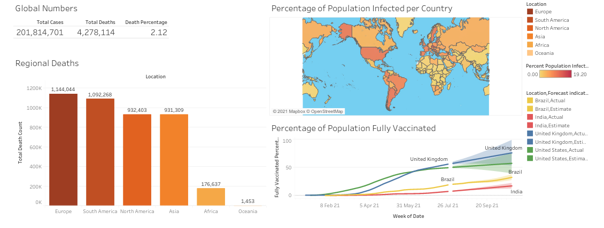

# covid_dashboard

## Project overview
This repository contain an image of a tableau dashboard about the statistics of COVID-19 and the files which were used to create this. This includes the covid-19 data obtained from ourworldindata, a python script which processes the data using sql queries and the resultant csv files which were derived from the queries.

## Dependencies
Python 3 and sqlite were used for this project. To obtain the relevant python package dependencies run the following command:

`pip3 install pandas sqlite3 sqlalchemy`

## Acknowledgements
The data used for this project was obtained using the following <a href=https://ourworldindata.org/covid-deaths>link</a>. Special regards are given to **Our World in Data** for allowing their data to be freely available for use.
